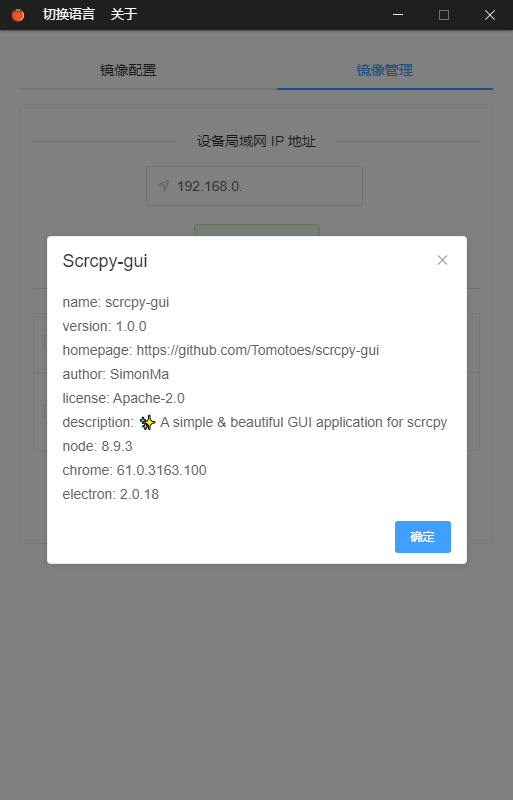

	
	 
	<h1>Scrcpy GUI</h1>
	Built with ❤︎ by <a href="https://tomotoes.com">Simon Ma</a> - <a href="https://github.com/Tomotoes/scrcpy-gui/blob/master/README.zh_CN.md">中文文档</a>

✨ <strong>A simple & beautiful GUI application for scrcpy</strong>

## 💡Introduction

This repository modified from [Tomotoes/scrcpy-gui](https://github.com/Tomotoes/scrcpy-gui) for personal preference and update irrgularly.

## ✨Features

2020/2/10:
- **minimize to tray**
- **close ADB when quit application**
- modified some UI components