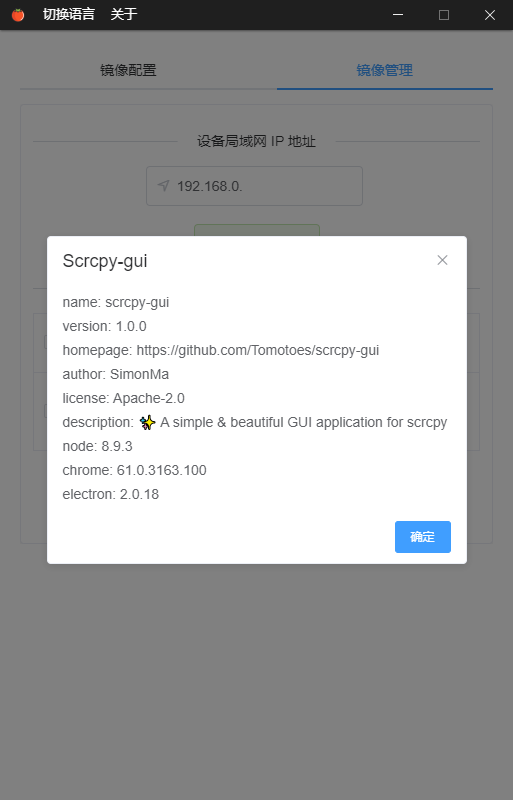

<div align="center">
	
	<br>
	<h1>Scrcpy GUI</h1>
	<sub>Built with ❤︎ by <a href="https://tomotoes.com">Simon Ma</a> - <a href="https://github.com/Tomotoes/scrcpy-gui">English document</a></sub>
</div>
<hr/>
<p align="center">✨ <strong>一个简洁&漂亮的 scrcpy GUI 应用</strong></p>

## 💡简介

这个仓库是从[Tomotoes/scrcpy-gui](https://github.com/Tomotoes/scrcpy-gui)根据个人喜好修改而来的，自用
<div align=center></div>

## ✨亮点

2020年2月10日:
- **增加了最小化到托盘**
- **增加了退出程序后关闭adb**
- 修改了一些UI组件

## 🌞要求

1. `Android 5.0`以上

2. 打开USB调试

   在 `开发人员选项` 打开 `USB调试`，USB连接手机
   

3. 安装好`ADB` ，并配置环境变量。

   [Windows](https://dl.google.com/android/repository/platform-tools-latest-windows.zip)
   [Mac OS](https://dl.google.com/android/repository/platform-tools-latest-darwin.zip)
   [Linux](https://dl.google.com/android/repository/platform-tools-latest-linux.zip)

   在任何路径下打开命令行，键入 `ADB` 有反馈。

4. 安装好`scrcpy`，并配置环境变量

  - Windows

    Windows 可以使用包含所有依赖项（包括adb）的预构建存档：

    下载下面`scrcpy`的压缩包，里面有`ADB`文件，然后把解压后的`scrcpy`文件夹添加到环境变量，再重启电脑，就可以了。

    1. [`scrcpy-win32-v1.10.zip`](https://github.com/Genymobile/scrcpy/releases/download/v1.10/scrcpy-win32-v1.10.zip)
       *(SHA-256: f98b400b3764404b33b212e9762dd6f1593ddb766c1480fc2609c94768e4a8e1)*
    2. [`scrcpy-win64-v1.10.zip`](https://github.com/Genymobile/scrcpy/releases/download/v1.10/scrcpy-win64-v1.10.zip)
       *(SHA-256: 95de34575d873c7e95dfcfb5e74d0f6af4f70b2a5bc6fde0f48d1a05480e3a44)*

    你也可以[手动构建](https://github.com/Genymobile/scrcpy/blob/master/BUILD.md)。

  - Mac OS

    可以使用 [Homebrew](https://brew.sh/) 来安装：

    ```
    brew install scrcpy
    ```

    如果你还没有安装`ADB`，可以使用下面的命令：

    ```
    brew cask install android-platform-tools
    ```

    你也可以[手动构建](https://github.com/Genymobile/scrcpy/blob/master/BUILD.md)。

  - Linux

    你可能需要[手动构建应用程序](https://github.com/Genymobile/scrcpy/blob/master/BUILD.md)。别担心，这并不难。

    此外，提供了 [Snap](https://en.wikipedia.org/wiki/Snappy_(package_manager)) 包：[`scrcpy`](https://snapstats.org/snaps/scrcpy)

    对于 Arch Linux， 可以使用 [AUR](https://wiki.archlinux.org/index.php/Arch_User_Repository) 包：[`scrcpy`](https://aur.archlinux.org/packages/scrcpy/)

    对于 Gentoo，可以使用 [Ebuild](https://wiki.gentoo.org/wiki/Ebuild) 包： [`scrcpy/`](https://github.com/maggu2810/maggu2810-overlay/tree/master/app-mobilephone/scrcpy)


## 🎉安装

点击此处下载[应用](https://github.com/Tomotoes/scrcpy-gui/releases)。


## 🎇使用

### 连接方法

#### 必备条件

- 请确保 **adb , scrcpy** 可正常使用
- 请确保手机已打开 USB 调试, 并已认证电脑调试

#### 有线连接

1. 请确保手机已通过数据线连接到电脑

2. 等待软件自动检测到设备
3. 选中设备，点击`打开选中的镜像`
4. 等待设备打开

#### 无线连接

1. 请确保手机与电脑处在同一局域网

2. 第一次无线连接时:
   - **请确保手机已通过数据线连接到电脑**
   - **请确保只有一个手机通过数据线连接到电脑**
   - 第一次需设置端口，以后连接手机，只需要添加手机的静态IP即可

3. 输入手机的局域网`IP`地址（如果`IP`为`DHCP`分配，请更改为静态`IP`）

4. 点击`开启无线连接`

5. 等待无线连接成功

6. 选中设备，点击`打开选中的镜像`

7. 等待设备打开


### 快捷键

| 操作                             | 快捷键                       | 快捷键 (macOS)              |
| -------------------------------- | ---------------------------- | --------------------------- |
| 切换全屏模式                     | `Ctrl`+`f`                   | `Cmd`+`f`                   |
| 将窗口调整为 1:1                 | `Ctrl`+`g`                   | `Cmd`+`g`                   |
| 调整窗口大小以删除黑色边框       | `Ctrl`+`x` \| *双击黑色背景* | `Cmd`+`x` \| *双击黑色背景* |
| 设备`HOME`键                     | `Ctrl`+`h` \| *鼠标中键*     | `Ctrl`+`h` \| *鼠标中键*    |
| 设备`BACK`键                     | `Ctrl`+`b` \| *鼠标右键*     | `Cmd`+`b` \| *鼠标右键*     |
| 设备`任务管理`键                 | `Ctrl`+`s`                   | `Cmd`+`s`                   |
| 设备`菜单`键                     | `Ctrl`+`m`                   | `Ctrl`+`m`                  |
| 设备`音量+`键                    | `Ctrl`+`↑`                   | `Cmd`+`↑`                   |
| 设备`音量-`键                    | `Ctrl`+`↓`                   | `Cmd`+`↓`                   |
| 设备`电源`键                     | `Ctrl`+`p`                   | `Cmd`+`p`                   |
| 点亮手机屏幕                     | *鼠标右键*                   | *鼠标右键*                  |
| 关闭设备屏幕（保持镜像）         | `Ctrl`+`o`                   | `Cmd`+`o`                   |
| 展开通知面板                     | `Ctrl`+`n`                   | `Cmd`+`n`                   |
| 折叠通知面板                     | `Ctrl`+`Shift`+`n`           | `Cmd`+`Shift`+`n`           |
| 将设备剪贴板中的内容复制到计算机 | `Ctrl`+`c`                   | `Cmd`+`c`                   |
| 将计算机剪贴板中的内容粘贴到设备 | `Ctrl`+`v`                   | `Cmd`+`v`                   |
| 将计算机剪贴板中的内容复制到设备 | `Ctrl`+`Shift`+`v`           | `Cmd`+`Shift`+`v`           |
| 安装`APK`                        | 将`APK`文件拖入投屏          | 将`APK`文件拖入投屏         |
| 传输文件到设备                   | 将文件拖入投屏               | 将文件拖入投屏              |
| 启用/禁用FPS计数器（stdout）     | `Ctrl`+`i`                   | `Cmd`+`i`                   |


## 🎯开发

``` bash
# install dependencies
npm install

# serve with hot reload at localhost:9080
npm run dev

# build electron application for production
npm run build

# lint all JS/Vue component files in `src/`
npm run lint
```